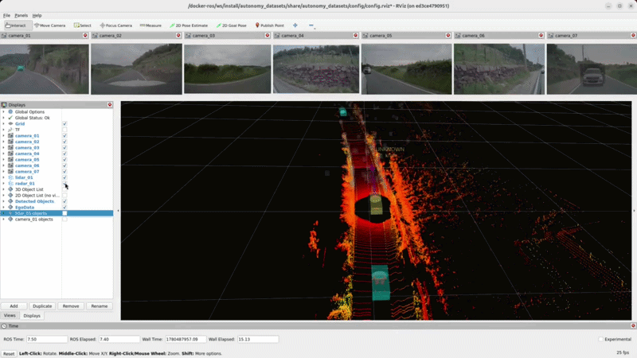
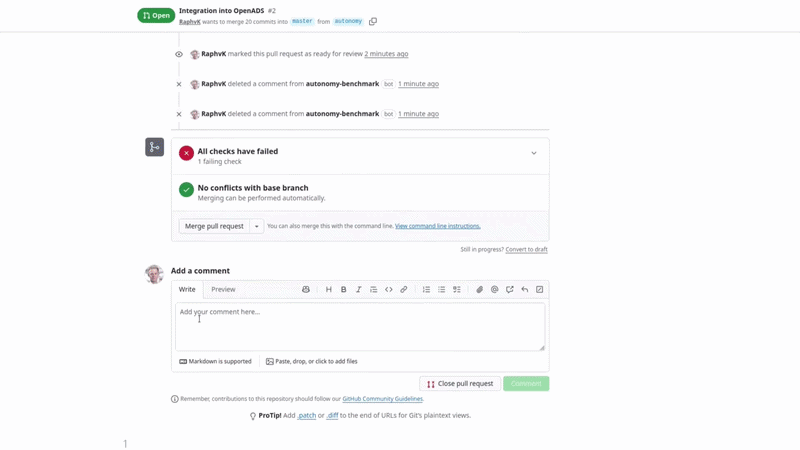

# Thinking Cars GmbH – Qualifying the Future of Open-Source Automated Driving

**Open. Transparent. Qualified.**
> We build the benchmark for transparent, trustworthy, and sovereign AD software.
> Making open-source driving stacks easier to evaluate, easier to trust, and easier to integrate.

---

## 🎯 What We Do

Open-source automated driving stacks are powerful, but without transparent benchmarking and qualification, industrial adoption remains slow and risky. 
**We close that gap.** Not with black-box claims, but with transparent benchmarks run on your data, structured qualification documentation, and evidence that holds up where it counts.

| | |
|---|---|
| ✅ **100 % Transparent & Open-Source** | Every evaluation process is fully documented and reproducible |
| 🔓 **0 % Vendor Lock-In** | Built on open ecosystems |
| ♾️ **Unlimited Integration Possibilities** | Modular approach supports any target stack or application |

---

## 🛠️ Our Services

### 🔍 Discover 
We identify the right open-source components for your target application and compliance requirements, and map them against your existing stack.

### 📊 Evaluate – *Prototype Available*
Automated evaluation and testing for open-source AD components. Transparent, reproducible metrics and report generation. Running on **your data** for **your auditable evidence**.

### 📋 Qualify – *Coming Soon*
Structured qualification documentation aligned with relevant standards. Ready for internal sign-off or external regulatory audit.

### 🔧 Integration & Long-Term Support – *Coming Soon*
Expert consulting to help OEM and autonomy teams select, adopt, and integrate open-source AD software into real delivery pipelines.

---
## 📦 Key Repositories

### 🏎️ Benchmarking (`thinking-cars`)

| Repository | Description | Teaser | Release |
| ---------- | ----------- | ------ | ------- |
| [autonomy_datasets](https://github.com/thinking-cars/autonomy_datasets) | Unified ROS 2 Interface for automated driving datasets. |  |  |
| [autonomy_evaluation](https://github.com/thinking-cars/autonomy_evaluation) | Within the Autonomy.Benchmarks suite, Autonomy.Evaluation generates the metrics-based evidence for benchmarking automated driving deployments. |  |  |
| [autonomy_bot]() | Easily benchmark automated driving modules and full AD stacks as part of your CI/CD workflow. |  | 🚧 Under Construction |

### 🧩 OpenADS — Open Automated Driving Systems (`openads-project`)

Thinking Cars is an active contributor and maintainer in the OpenADS community — an ecosystem for building and benchmarking interoperable AD software. Developed as part of Germany's [Ecosystem Mobility 4.0](https://ecosystemmobility40.de/en/home/) initiative and aligned with the [European Connected and Autonomous Vehicle Alliance](https://digital-strategy.ec.europa.eu/en/policies/vehicle-alliance).

| Repository | Description | Release |
| ---------- | ----------- | ------- |
| [OpenADS](https://github.com/openads-project/) | [**Open Automated Driving Systems Ecosystem**](https://openads-project.github.io), including automated driving software stack, simulation and development toolchain. |  |
| [OpenADStack](https://openads-project.github.io/openadstack/openadstack.html) | Baseline reference implementation for modular ROS 2 automated-driving stacks in OpenADS. |  |
| [OpenADSim](https://openads-project.github.io/openadsim/openadsim.html) | Simulation environment for testing the OpenADStack with CARLA or SUMO. |  |
| [OpenADSuite](https://openads-project.github.io/openadsuite/openadsuite.html) | Development tools that streamline developer workflows, such as module templates and ready-to-use development environments. |  |
| [OpenADSafety 🚧](https://openads-project.github.io/openadsafety/openadsafety.html) | Documentation and tools for validation and verification of automated-driving modules and full stacks. |  |

#### OpenADS Module Integrations

| Repository | Description | Teaser | Release |
| ---------- | ----------- | ------ | ------- |
| [autoware_lidar_centerpoint](https://github.com/thinking-cars/autoware_lidar_centerpoint) | Modularized 3D lidar detection model from [Autoware Universe](https://github.com/autowarefoundation/autoware_universe). |  |  |
| [autoware_multi_object_tracker](https://github.com/thinking-cars/autoware_multi_object_tracker) | Modularized 3D multi-object tracker from [Autoware Universe](https://github.com/autowarefoundation/autoware_universe). |  |  |
| [focalformer3d_detector](https://github.com/thinking-cars/focalformer3d_detector) | ROS 2 integration of the [NVlabs/FocalFormer3D](https://github.com/NVlabs/FocalFormer3D) lidar object detection model. |  |  |

---

## 🎓 Research & Events

| Event | Description | Status |
|---|---|---|
| [**IEEE ITSC 2026 Tutorial**](https://openads-project.github.io/tutorial-itsc-26/) | OpenADS tutorial at IEEE International Conference on Intelligent Transportation Systems, Naples, Italy | ✅ Active |

